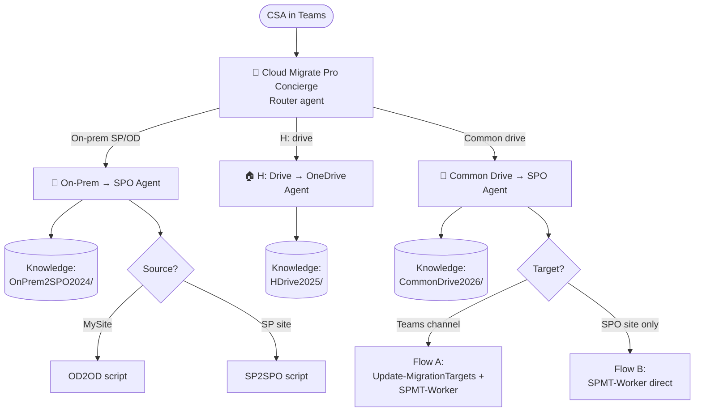

<p align="center">
  
</p>

# Cloud Migrate Pro — Copilot Studio Agent Package

A complete, ready-to-port package for publishing **Cloud Migrate Pro**, a
multi-agent migration assistant in Microsoft Copilot Studio. A routing
**Cloud Migrate Pro Concierge** front-ends three specialist sub-agents,
helping CSAs run three proven migration playbooks without cross-contamination
between scenarios.

> **Author:** Douglas Cox
> **Version:** 1.0 (June 2026) — initial release
> **Date:** June 2026
> **Audience:** Cloud Solution Architects (CSAs)

---

## What's in the package

```
CopilotStudio-AgentPackage/
├── 00-README.md                         ← you are here
├── 01-Concierge/                        ← front-door router agent
│   ├── system-prompt.md
│   ├── topics.md
│   └── welcome-card.json
├── 02-OnPrem2SPO-Agent/                 ← 2024 playbook (SP/OD on-prem → SPO)
│   ├── system-prompt.md
│   ├── topics.md
│   ├── workflows.md                     ← Mermaid diagrams
│   └── knowledge-cards.md
├── 03-HDrive-Agent/                     ← 2025 playbook (H: drive → OneDrive)
│   ├── system-prompt.md
│   ├── topics.md
│   ├── workflows.md
│   └── knowledge-cards.md
├── 04-CommonDrive-Agent/                ← 2026 playbook (UNC → Teams/SPO)
│   ├── system-prompt.md
│   ├── topics.md
│   ├── workflows.md
│   └── knowledge-cards.md
├── 05-Porting-to-CopilotStudio.md       ← step-by-step build guide
├── 06-Launch-Kit.md                     ← announcement, demo, quick-reference
└── Cloud-Migrate-Pro-Agent-How-We-Built-It.md  ← training case study (decisions, gotchas, reusable patterns)
```

---

## The architecture in one picture



---

## Why this design

| Goal | How it's achieved |
|---|---|
| **No cross-scenario hallucination** | Each child agent has its own scoped knowledge folder; system prompts hard-refuse out-of-scope questions |
| **Single entry point for CSAs** | The Concierge is the only published Teams app; it routes silently |
| **Scenario-specific guidance** | Per-agent topics + Mermaid workflow diagrams rendered in chat |
| **Citable answers** | Knowledge grounding cites the exact `.ps1` file the answer came from |
| **Easy to extend** | Add a new scenario = add a new child agent + knowledge folder |

---

## What the agents will and won't do

| ✅ Will | ❌ Will not |
|---|---|
| Explain any script in its silo | Execute scripts on the CSA's machine |
| Generate ready-to-paste command lines | Invent parameters not in the scripts |
| Render workflow diagrams | Mix advice across silos |
| Cite the source `.ps1` file | Promise things the scripts don't do |
| Walk a CSA through prereqs | Replace placeholder values for them |

---

## Quick start

1. Read **`05-Porting-to-CopilotStudio.md`** for the step-by-step build.
2. In Copilot Studio, create the 4 agents in this order:
   1. The three child agents (so the Concierge can connect to them)
   2. The Concierge last (it references the children)
3. Upload the per-agent knowledge files (the sanitized `.ps1` files + the
   `knowledge-cards.md` in each folder).
4. Paste the `system-prompt.md` into each agent's instructions.
5. Author the topics from `topics.md`.
6. Publish the Concierge to Teams.
7. Use **`06-Launch-Kit.md`** to announce.

---

## Naming

- **Suite name:** Cloud Migrate Pro
- **Public name (Teams app, router agent):** Cloud Migrate Pro Concierge
- **Tagline:** *Three playbooks. One front door.*
