# On-Prem → SharePoint Online — Workflow

This document describes the script-accurate workflow for the two on-prem to
SharePoint Online migration flows:

- **Flow A — OD2OD:** `Migration-OD2OD-SPO.ps1` — on-prem MySite → SPO OneDrive
  with full AD + SCA cutover.
- **Flow B — SP2SPO:** `Migration-SP2SPO.ps1` — on-prem SharePoint site → SPO
  site (content-only).

The two flows share most steps; OD2OD-only branches are labeled explicitly.

```mermaid
flowchart TD
    Start([Script start]) --> Boot[Bootstrap:<br/>Ensure-Module SPO PS, SPMT PS,<br/>ActiveDirectory, PnP.PowerShell<br/>+ Add-Type SP Client DLLs]
    Boot --> Pre[Pre-launch SPMT exe silent + kill<br/>so DLLs are extracted]
    Pre --> Cred{Credentials<br/>cached in session?}
    Cred -->|No| Prompt[Get-Credential x2:<br/>SPO admin + on-prem admin]
    Cred -->|Yes| Trans
    Prompt --> Trans[Start-Transcript:<br/>F:\SPMTLOGS\Log_SERVER_TIMESTAMP.log]
    Trans --> Conn[Connect-PnPOnline to SPO list site<br/>UseWebLogin]
    Conn --> L[(SPO driver list<br/>OneDriveMigrationStatus / SPOMigrationStatus)]
    L --> Scan[Scan all rows:<br/>skip rows where<br/>Migrate is blank OR Migrated<br/>OR already Processing]
    Scan --> Mark[For rows where Migrate = Migrate:<br/>set Inprocess/Processing = Processing<br/>stamp Server = COMPUTERNAME]
    Mark --> Loop{For each<br/>queued row}
    Loop --> StartD[Stamp DateStarted = now]
    StartD --> Reg[Register-SPMTMigration<br/>-SPOCredential -SkipFilesWithExtension<br/>-KeepAllVersions -MigrateFileVersionHistory]
    Reg --> Add[Add-SPMTTask<br/>source URL to target URL<br/>-MigrateAll<br/>-SharePointSourceCredential = on-prem]
    Add --> Run[Start-SPMTMigration<br/>blocks until done]
    Run --> Status{Get-SPMTMigration<br/>final status}
    Status -->|Finished, no FailureSummaryReport| OK[Migrate = Migrated<br/>Log = server + reportPath + transcript<br/>DateMigrated stamped<br/>Inprocess cleared]
    Status -->|Finished but FailureSummaryReport.csv exists| Err[Remove old attachment<br/>Attach new FailureSummaryReport.csv<br/>Migrate = ErrorLog]
    Status -->|Status not COMPLETED| Fail[Migrate = Failed<br/>Log stamped<br/>Inprocess cleared for retry]
    OK --> ODonly{OD2OD<br/>flow?}
    Err --> ODonly
    ODonly -->|Yes| SCA[SCA swap on source MySite<br/>EnsureUser svc-migration<br/>make Site Collection Admin<br/>demote migrated user]
    ODonly -->|No SP2SPO| Sleep
    SCA --> WWW[Set-ADUser wwwHomePage = new OneDrive URL]
    WWW --> Grp[Remove user from *REDIRECTION* groups<br/>Remove from SecFltr-USR-OneDrive<br/>Add to SecFltr-USR-Office365]
    Grp --> Flags[List columns:<br/>wwwHomePage = Updated<br/>OnPrem-Disabled = Disabled]
    Flags --> Sleep[Start-Sleep<br/>OD2OD = 30s<br/>SP2SPO = 120s<br/>throttle pause]
    Fail --> Sleep
    Sleep --> Loop
    Loop -->|All rows processed| End[Stop-Transcript]
    End --> Note[Power Automate flow on list<br/>watches Migrate = ErrorLog/Failed<br/>emails affected user<br/>script does NOT send mail]
```

---

## Shared characteristics

- **Engine:** SPMT 4.2.129.0+ via the PowerShell SPMT module.
- **Throttle / inter-row sleep:** the two flows pause for different durations between rows.
  - **OD2OD = 30 seconds** (Migration-OD2OD-SPO09132024 line 481, `Start-Sleep -Seconds 30`).
  - **SP2SPO = 120 seconds** (Migration-SP2SPO09132024 line 252, `Start-Sleep -Seconds 120`).
  - Per-user MySite migrations are smaller and can cycle faster than full SP-site migrations — the difference is intentional, not a bug.
- **Idempotency lock:** different column names by flow.
  - **OD2OD** uses `Inprocess`.
  - **SP2SPO** uses `Processing`.
  - Both stamp `Server = $env:COMPUTERNAME` so operators can see which host is
    working the row.
- **Status writeback:** the `Migrate` column transitions
  `Migrate → (Processing in lock column) → Migrated | ErrorLog | Failed`.
  `ErrorLog` means per-file errors with `FailureSummaryReport.csv` attached to
  the list item.
- **Driver column value:** rows must be set to `Migrate = Migrate` to be picked
  up. Blank, `Migrated`, `Processing`, and `Failed` rows are skipped.
- **Error UX:** failure emails are sent by a **Power Automate flow on the
  list**, not by the script. Configure the flow to watch
  `Migrate = ErrorLog / Failed`.
- **AD cutover (OD2OD only):** on every successful migration the script
  - stamps `wwwHomePage` with the new OneDrive URL,
  - removes the user from all groups matching `*REDIRECTION*`,
  - removes the user from `SecFltr-USR-OneDrive`,
  - adds the user to `SecFltr-USR-Office365`,
  - stamps `OnPrem-Disabled = Disabled` on the row.
- **SCA swap (OD2OD only):** on the **source on-prem MySite**, the script
  promotes `svc-migration` to Site Collection Admin and demotes the migrated
  user. SP2SPO does not perform an SCA swap.
- **DLL paths differ** — OD2OD loads `Microsoft.SharePoint.Client*.dll` from
  `F:\Tools\`; SP2SPO loads from `F:\IAU_Scripts\OneDrive_Migration_Scripts\`.
  A wrong path produces an `Add-Type` failure at bootstrap.
- **Version history is preserved** end-to-end via `-KeepAllVersions $true` and
  `-MigrateFileVersionHistory $true`.
- **Blocked extensions** default: `.aspx, .pst, .exe, .dll` (extensible).
