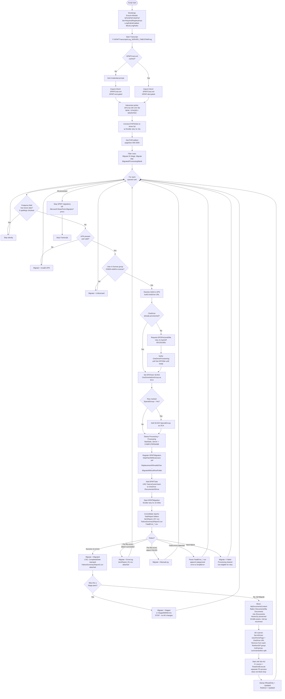

# H: Drive → OneDrive — Workflow

This document describes the script-accurate workflow for `Hdrive-OneDriveScript`
(v5.2). The script migrates per-user network home drives from
`\\server\users\<sam>` to OneDrive `/Documents/HDrive`, and performs an AD
cutover on success.

The script has two operational modes driven by the row's `Migrate` column:

- **Stage** — content copy only, no AD changes. Used as a pre-pass to seed
  data without affecting the user.
- **Migrate** — full migration: content copy, then My Documents reorg, AD
  cutover, and source lockdown.

---

## State management notes

- **Processing flag** is cleared only on the `Failed` path so the row is
  retryable. Success / ErrorLog / ManualLog / Fatal paths leave it set and
  write a terminal `Migrate` value instead.
- **SPO connection** is re-established after errors via `Ensure-PnPConnection`,
  with a `$script:PnPConnectionCache` keyed by URL to keep reconnects cheap.
- **SPMT session** is properly disposed even on failure (cleanup at end of run
  also stops migrations and kills `Microsoft.SharePoint.Migration*` processes).
- **SCA cleanup:** the script **adds** SCA02 (`OneDriveAdminGroup`) and
  optionally SCA03 (`SpecialGroup` when the row sets `SpecialGroup = Yes`) but
  does **not** remove them post-migration. Clean up manually with
  `Remove-SPOUser` if your governance requires it.
- **AD group flips — what actually happens:**
  - The script **removes** the user from every group listed in the row's
    `RedirectGP` column (multi-group, comma- or newline-separated).
  - The script **adds** the user to `$targetGroup` (`SecFltr-USR-Office365`)
    on success via `Add-ADGroupMember`.
  - The script **only validates** that the user is a member of the license
    group `$targetGroup2` (`O365S-AddOn-License`) and sets `Migrate =
    Unlicensed` (skipping the row) if not. It does NOT add to the license
    group — the license grant must happen upstream of the migration.
- **Stage mode stops before AD cutover** — the `Staged` / `StagedWithErrors`
  terminal states do not perform My Documents reorg, AD changes, or source
  lockdown. Re-run the row with `Migrate = Migrate` to complete the cutover.
- **ACL changes** run in a separate PowerShell process so a slow ACL walk does
  not block the user loop.
- **Throttle handling:** `Handle-SPOThrottling` (5x, 10–300s, honors
  `Retry-After` headers) wraps PnP connections, list reads, SPMT calls, and
  per-item content moves.
- **Long-path support:** registry keys `LongPathsEnabled=1`,
  `BlockLongPaths=0`, `UseLegacyPathHandling=0` are set on bootstrap.
- **Audit trail per row:** `StartDate`, `CompletedDate`, `Server`, `LOG`,
  `ScriptError` (categorized: LICENSE / UPN / ONEDRIVE PROVISIONING /
  ATTACHMENT / CONTENT MOVE / AD / SITE ADMIN / FATAL / GENERAL), `HReadOnly`,
  `Redirect`, plus `FailureSummaryReport2.csv` and `FatalError_*.csv`
  attached to the row.
