# Common Drive → Teams / SharePoint — Workflow

This document describes the script-accurate workflow for the Common Drive
migration suite. The suite has two target flows that share the same
orchestrator, scheduling, claim-locking, and post-migration cleanup:

- **Flow A** — UNC shared drive → **Teams channel folder** (via Graph)
- **Flow B** — UNC shared drive → **SharePoint site** directly

```mermaid
flowchart TD
    CSV[CSV: UNC paths + TeamName +<br/>Channel + TimeZone + Priority<br/>+ DIV + ExtendedHours] --> Imp[Import-MigrationSources.ps1<br/>enumerate subfolders, dedupe,<br/>create per-DIV filtered views<br/>Migrate column starts blank]
    Imp --> L[(SPO list:<br/>CommonDriveMigration)]
    L --> Scan[Invoke-UNCStorageScan.v2.ps1<br/>multi-server claim ClaimedBy/ClaimedAt<br/>local lock file UNCScan.lock<br/>parallel runspaces 2x CPU]
    Scan --> Buckets[Stamp Size3YrMB, Size5YrMB, Size7YrMB<br/>FileCount, DirCount, Errors<br/>ScanDuration, Date<br/>attach error CSV if any]
    Buckets --> Flow{Flow A Team/Channel<br/>OR Flow B direct SPO site?}
    Flow -->|Flow A| P1[Update-MigrationTargets.v2.ps1<br/>PHASE 1 - mostly app-only Graph]
    P1 --> Find[Find-TeamByName<br/>Find-ChannelByName<br/>Get-TeamSiteUrl via /groups/id/sites/root]
    Find --> Own[Add-TeamGroupOwner<br/>app-only adds svc-migration<br/>as M365 Group Owner]
    Own --> ProvF[Get-ChannelFilesFolder<br/>DELEGATED auth only path<br/>sovereign/IL6 workaround<br/>5x retry x 30s]
    ProvF --> P2
    Flow -->|Flow B| P2
    P2[Update-MigrationTargets.v2.ps1<br/>PHASE 2 - app-only SPO Admin]
    P2 --> Quota[Read StorageQuota, StorageUsed<br/>compute StorageAvailable<br/>stamp LastChecked - GATING FIELD]
    Quota --> Opt[Get-OptimalYearCutoff<br/>try 7yr fits? -> else 5yr -> else 3yr<br/>10 pct safety buffer<br/>stamp YearUsed]
    Opt --> SCA[Grant-SitePermission<br/>svc-migration as Site Collection Admin<br/>via Set-PnPTenantSite]
    SCA --> Ready[Operator flips Migrate column:<br/>Stage / MigrateOnly / Migrate]
    Ready --> Orch[CommonDriveMigration.v2.ps1<br/>orchestrator<br/>-Continuous -MaxRuntime<br/>-AppClientIdParam multi-instance]
    Orch --> Pick[Get-SPOListItems<br/>sort by Priority then QueuedAt FIFO<br/>filter where LastChecked set]
    Pick --> ClaimQ{Claim row atomic<br/>ClaimedBy = SERVER:N<br/>ClaimedAt = now<br/>stale-release after 2h}
    ClaimQ -->|Claim failed| Pick
    ClaimQ -->|Won claim| Win{Inside scheduling window?<br/>blocks weekday 06:00-17:00 local<br/>allows nights, weekends,<br/>10 US federal holidays<br/>overnight grace til 04:00}
    Win -->|No| Rel[Release claim<br/>move to next row]
    Rel --> Pick
    Win -->|Yes| Big{Row size >= 10 GB?}
    Big -->|Yes AND not weekend/holiday/ExtendedHours| Rel
    Big -->|OK to run| Worker[Invoke-SPMTInSeparateProcess<br/>spawns SPMT-Worker.v2.ps1<br/>isolated PS process<br/>dodges PnP assembly conflicts]
    Worker --> Json[Build SPMT JSON task:<br/>MigrateItemsModifiedAfter = YearUsed cutoff<br/>SkipFilesWithExtension list<br/>target path under channel folder or site]
    Json --> RunW[Register-SPMTMigration<br/>Add-SPMTTask<br/>Start-SPMTMigration<br/>return JSON: success, reportPath, errors]
    RunW --> Outcome{Outcome?}
    Outcome -->|Stage path success| Staged[Migrate = Staged]
    Outcome -->|Stage path errors| StagedE[Migrate = StagedWithErrors]
    Outcome -->|Migrate path success| Done[Migrate = Migrated]
    Outcome -->|Per-file errors| ErrR[Migrate = ErrorLog<br/>ItemReport_R1.csv attached<br/>error category captured]
    Outcome -->|Hard failure| FailR[Migrate = Failed<br/>claim released for retry]
    Done --> Reacl[Set-SourceReadOnly Reacl<br/>break inheritance<br/>flip non-admin ACLs FullControl/Modify<br/>to ReadAndExecute]
    Reacl --> Del[Start-SourceDeletionInNewWindow<br/>separate PS window<br/>builds DeletionReport.csv<br/>attaches to row]
    Del --> Empty[Remove-EmptyFoldersAfterMigration<br/>triple-verified bottom-up recursion]
    Empty --> Pick
    Staged --> Pick
    StagedE --> Pick
    ErrR --> Retry[Retry-FailedMigration.ps1<br/>reads ItemReport_R1 + ItemFailureReport<br/>detects 0-byte uploads<br/>re-queues for next run]
    Retry --> Pick
    FailR --> Pick
    Pick -->|MaxRuntime hit OR no more rows| Stop[Stop-Transcript]
    L -.->|read by| Dash[New-MigrationDashboard.ps1<br/>HTML pipeline per DIV<br/>Awaiting Scan / Awaiting Target /<br/>Resolved / Queued / Migrating / Complete]
    Dash -.->|publish to| Pages[SPO sub-pages<br/>under /sites/.../SitePages/]
    L -.->|read by| Land[New-MigrationLandingPage<br/>+ UserManualPage<br/>+ SystemDocumentationPage]
    Land -.->|publish to| Pages
```

---

## Pipeline phases

| Phase | Script | Purpose |
|---|---|---|
| 1. Source import | `Import-MigrationSources.ps1` | CSV of UNC paths → SPO list, enumerate subfolders, create per-DIV filtered views, dedupe. `Migrate` starts blank. |
| 2. Storage scan | `Invoke-UNCStorageScan-v2.ps1` | Multi-server claim-locked parallel scan. Buckets file ages into 3 / 5 / 7-year totals and stamps row. |
| 3a. Target resolve (Flow A) | `Update-MigrationTargets.v2.ps1` Phase 1 | Graph (mostly app-only) — find Team + Channel, add `svc-migration` as M365 Group Owner, and trigger channel folder provisioning via one delegated call (sovereign/IL6 workaround). |
| 3b. Quota + SCA | `Update-MigrationTargets.v2.ps1` Phase 2 | App-only SPO Admin — read quota/used, compute `StorageAvailable`, stamp `LastChecked` (the gating field), and grant SCA. |
| 4. Year-cutoff fit | `Get-OptimalYearCutoff` (in orchestrator) | Try 7 → 5 → 3 years to fit `StorageAvailable` with a 10% safety buffer; stamp chosen horizon as `YearUsed`. |
| 5. Operator handoff | (manual) | Operator flips `Migrate` column to `Stage`, `MigrateOnly`, or `Migrate`. |
| 6. Orchestration | `CommonDriveMigration.v2.ps1` | Sorts by `Priority` then `QueuedAt`, claims rows atomically, enforces scheduling, dispatches SPMT, runs post-migration cleanup. |
| 7. SPMT execution | `SPMT-Worker.v2.ps1` | Isolated PowerShell process per task to avoid PnP assembly conflicts. Returns JSON outcome. |
| 8. Post-migration | `Set-SourceReadOnly`, `Start-SourceDeletionInNewWindow`, `Remove-EmptyFoldersAfterMigration` | Reacl source to read-only, delete in separate window with `DeletionReport.csv`, triple-verified empty-folder cleanup. |
| 9. Retry | `Retry-FailedMigration.ps1` | Re-process per-file errors and detect 0-byte uploads. |
| 10. Reporting | `New-MigrationDashboard.ps1`, `New-MigrationLandingPage.ps1`, `New-MigrationUserManualPage-Simple.ps1`, `New-SystemDocumentationPage.ps1`, `Deploy-SystemDocumentation.ps1` | HTML pipeline dashboard, per-DIV landing page, end-user guide, architecture doc — all published to SPO pages. |

## Scheduling rules

- **Blocked window:** weekday 06:00–17:00 local time (per-row `TimeZone`).
- **Allowed windows:** nights (17:00–06:00 local), all-day weekends, all-day on
  the 10 pre-configured US federal holidays for 2026–2027 plus overnight grace
  until 04:00 the day after a holiday.
- **`TimeZone = ANYTIME`** runs 24/7.
- **Large rows (≥ 10 GB)** are restricted to weekends/holidays unless
  `ExtendedHours = Yes`.
- **Priority + QueuedAt** enforce FIFO ordering with priority overrides before
  the claim attempt.

## Claim locking

- Atomic claim writes `ClaimedBy = SERVER:N` and `ClaimedAt = now` to the row.
- Stale-release after `ClaimStaleHours = 2h` (orchestrator) and
  `LockStaleHours = 0.5h` (local lock file for the UNC scanner) — protects
  against crashes.
- The scan phase, target phase, and migrate phase all use the same claim
  pattern, so 6+ servers can work the queue concurrently without
  double-processing any row.

## Error-state writeback

| State | Meaning |
|---|---|
| `Staged` / `StagedWithErrors` | Stage pass complete; no destination cutover yet. |
| `Migrated` | Full migration complete; Reacl + DeleteSource + empty-folder cleanup ran. |
| `ErrorLog` | Per-file errors; `ItemReport_R1.csv` attached, category captured. |
| `Failed` | Hard failure; claim released for retry next run. |

## Multi-instance / multi-server topology

`-AppClientIdParam` and `-AppCertThumbprintParam` allow each server (or each
worker on a server) to use a distinct app registration. This is a deployment
choice, not a hard-coded topology — typical production runs use one app per
worker to spread throttle buckets, but the script does not assume a specific
count.
